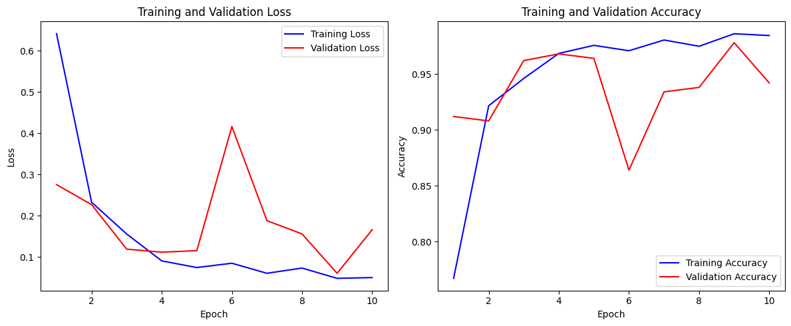

# Chest X-Ray Disease Classification

[](https://www.python.org/)
[](https://pytorch.org/)
[](https://streamlit.io/)
[](LICENSE)

A deep learning project that classifies chest X-ray images into **5 categories** using a
DenseNet121 convolutional neural network with transfer learning. It ships with a
Streamlit web app for interactive prediction and **Grad-CAM** visualisations that highlight
the regions the model focuses on.

> ⚠️ **Disclaimer:** This project is for **educational and research purposes only**.
> It is **not** a medical device and must **not** be used for clinical diagnosis or
> treatment decisions.

---

## Classes

The model predicts one of the following five conditions:

| Class | Description |
|-------|-------------|
| `bacterial_pneumonia` | Pneumonia caused by bacterial infection |
| `covid` | COVID-19 related lung findings |
| `normal` | Healthy chest X-ray |
| `tuberculosis` | Tuberculosis findings |
| `viral_pneumonia` | Pneumonia caused by viral infection |

---

## Features

- **DenseNet121** backbone pretrained on ImageNet, fine-tuned for 5-class classification.
- **Streamlit web app** — upload an X-ray and get an instant prediction.
- **Grad-CAM heatmaps** — visual explanation of which lung regions drove the prediction.
- **Command-line tools** for training, evaluation, and single-image prediction.
- **Google Colab notebook** for GPU-accelerated training.
- Reproducible training with a fixed random seed.

---

## Model & Approach

- **Architecture:** DenseNet121 (`torchvision`) with the classifier head replaced by a
  `Linear` layer sized to the 5 classes.
- **Transfer learning:** initialised from ImageNet weights; optional `--freeze_features`
  flag to train only the classifier head.
- **Input:** RGB images resized to `224 × 224`, normalised with ImageNet mean/std.
- **Augmentation (train):** random horizontal flip, small rotation, and color jitter.
- **Loss / optimizer:** CrossEntropyLoss with Adam (`lr=1e-4`, `weight_decay=1e-5`).
- **Checkpointing:** the best model by validation accuracy is saved to
  `models/densenet121_chestxray.pt`.

### Results

Trained for 10 epochs, the model reached a **best validation accuracy of ~97.8%**
(see `models/train_history.json`). Run `evaluate_model.py` to generate a full
classification report and confusion matrix on the test split.



---

## Dataset

The dataset is organised into `train`, `val`, and `test` splits, each containing one
folder per class (`torchvision.datasets.ImageFolder` layout):

```text
Dataset/
├── train/   (500 images per class — 2,500 total)
├── val/     (100 images per class —   500 total)
└── test/    (100 images per class —   500 total)
```

> **Data source:** The X-ray images were compiled from publicly available chest X-ray
> datasets on **[Kaggle](https://www.kaggle.com/)**. Please refer to and cite the
> original dataset authors when redistributing or publishing results. *(Update this
> section with the exact Kaggle dataset link and citation.)*

---

## Project Structure

```text
Chest X-Ray Disease Classification/
├── Dataset/                  # train / val / test image folders
├── models/                   # trained checkpoint + class names + history
│   ├── densenet121_chestxray.pt
│   ├── class_names.json
│   └── train_history.json
├── outputs/                  # evaluation reports, confusion matrix, Grad-CAM images
├── app.py                    # Streamlit web app
├── train_model.py            # training script
├── train_in_colab.ipynb      # Colab GPU training notebook
├── evaluate_model.py         # test-set evaluation (report + confusion matrix)
├── predict.py                # single-image prediction (CLI)
├── gradcam.py                # Grad-CAM generation utilities
├── model_utils.py            # shared model / I/O helpers
├── requirements.txt          # Python dependencies
├── LICENSE                   # MIT license
└── README.md
```

---

## Installation

Requires **Python 3.9+**.

```bash
# 1. Clone the repository
git clone https://github.com/<your-username>/chest-xray-disease-classification.git
cd chest-xray-disease-classification

# 2. (Recommended) create and activate a virtual environment
python -m venv .venv
# Windows
.venv\Scripts\activate
# macOS / Linux
source .venv/bin/activate

# 3. Install dependencies
pip install -r requirements.txt
```

> For GPU training, install the CUDA-enabled build of PyTorch from
> [pytorch.org](https://pytorch.org/get-started/locally/).

---

## Usage

### Run the web app

```bash
streamlit run app.py
```

Open the URL shown in the terminal, upload a chest X-ray image, and view the predicted
class, confidence, and Grad-CAM heatmap.

### Train the model

```bash
python train_model.py --data_dir Dataset --epochs 10 --batch_size 16
```

Common options: `--image_size`, `--seed`, `--model_dir`, `--freeze_features`.
For GPU training in the cloud, open `train_in_colab.ipynb` in Google Colab.

### Evaluate on the test set

```bash
python evaluate_model.py --data_dir Dataset --model_dir models --output_dir outputs
```

Produces `outputs/classification_report.txt` and `outputs/confusion_matrix.png`.

### Predict a single image

```bash
python predict.py --image path/to/chest_xray.png --show_heatmap --top_k 3
```

Prints the top-K predictions and (with `--show_heatmap`) saves a Grad-CAM overlay to
the `outputs/` directory.

---

## How Grad-CAM Works

Grad-CAM (Gradient-weighted Class Activation Mapping) uses the gradients of the predicted
class flowing into the final convolutional layer of DenseNet121 to produce a heatmap
highlighting the image regions most influential to the prediction. This adds a layer of
interpretability to an otherwise black-box model.

---

## Tech Stack

- **PyTorch** & **torchvision** — model and training
- **OpenCV** & **NumPy** — image processing and Grad-CAM overlay
- **scikit-learn** — evaluation metrics
- **Matplotlib** & **Seaborn** — plots and confusion matrix
- **Streamlit** — web interface
- **Pillow** — image loading

---

## License

This project is licensed under the **MIT License** — see the [LICENSE](LICENSE) file for
details.

---

## Author

**Chetan Mahajan**

If you find this project useful, consider giving it a ⭐ on GitHub.
