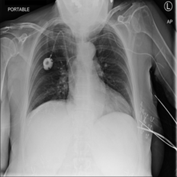
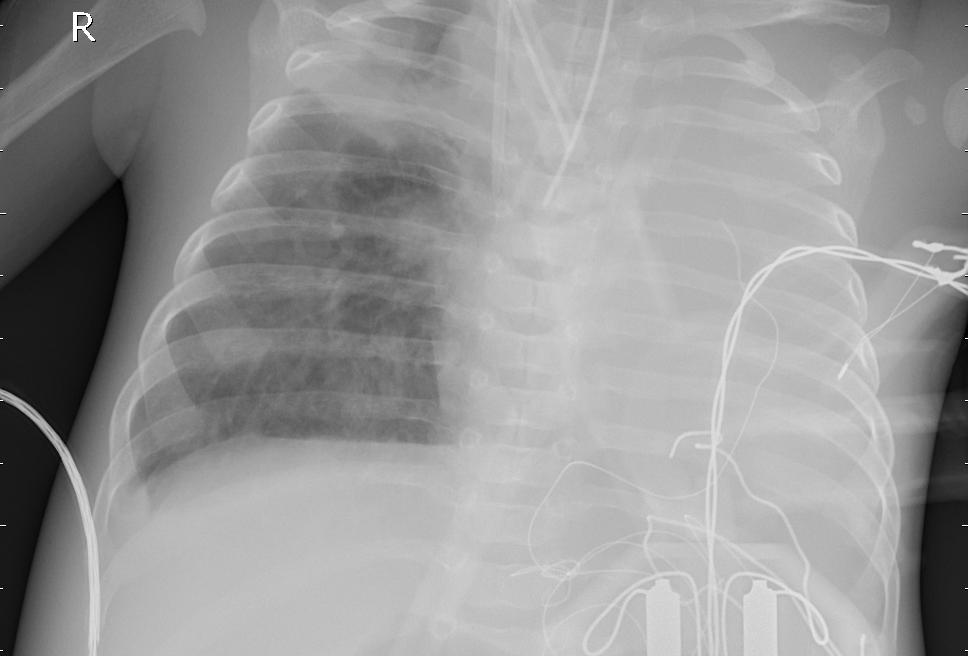
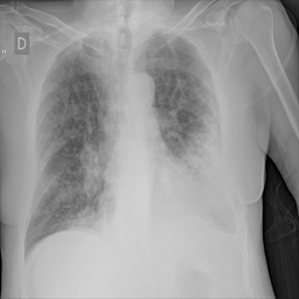
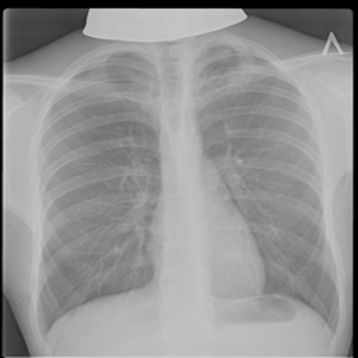
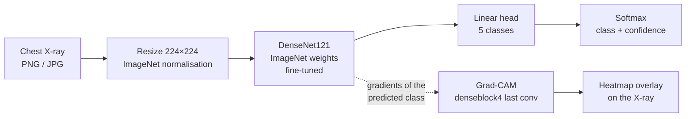

<div align="center">

# 🩻 Chest X-Ray Disease Classification

### Explainable deep learning for 5 chest conditions

**A DenseNet121 model that reads a chest X-ray and predicts bacterial pneumonia, COVID-19, tuberculosis, viral
pneumonia or a normal lung, and shows *where* it looked with Grad-CAM heatmaps.**


[](LICENSE)

</div>

> ⚠️ **Disclaimer:** for **educational and research purposes only**. This is not a medical device and must not be
> used for clinical diagnosis or treatment decisions.

---

## Overview

Chest X-rays are the most common imaging test in the world, and several serious lung diseases look alike on them.
This project fine-tunes an ImageNet-pretrained **DenseNet121** to separate **five classes**, and pairs every
prediction with a **Grad-CAM heatmap** so the model's reasoning can be inspected instead of trusted blindly.

<table>
  <tr>
    <td align="center"><br><sub>Normal</sub></td>
    <td align="center"><br><sub>Bacterial pneumonia</sub></td>
    <td align="center"><br><sub>Viral pneumonia</sub></td>
    <td align="center"><br><sub>COVID-19</sub></td>
    <td align="center"><br><sub>Tuberculosis</sub></td>
  </tr>
</table>
<p align="center"><sub>One example per class from the test split</sub></p>

## Results

| Metric | Value |
|---|---|
| **Best validation accuracy** | **97.8%** (epoch 9 of 10) |
| Final training accuracy | 98.4% |
| Validation set | 500 images, 100 per class (balanced) |
| Checkpoint | best epoch by validation accuracy → `models/densenet121_chestxray.pt` |

<p align="center"></p>

Run `evaluate_model.py` for the full per-class classification report and confusion matrix on the held-out test split.

## How it works



| | |
|---|---|
| **Backbone** | `torchvision` DenseNet121, ImageNet-pretrained, classifier replaced by a 5-way `Linear` layer |
| **Training** | CrossEntropyLoss, Adam (`lr=1e-4`, `weight_decay=1e-5`), fixed seed, optional `--freeze_features` |
| **Augmentation** | random horizontal flip, small rotations, colour jitter |
| **Explainability** | Grad-CAM on the last convolution of `denseblock4`: gradients of the predicted class weight the feature maps into a heatmap |

## Features
- 🖥️ **Streamlit app**: upload an X-ray, get the class, the confidence and a Grad-CAM overlay
- 🧪 **CLI tools** for training, test-set evaluation and single-image prediction (top-K + heatmap)
- ☁️ **Colab notebook** for free GPU training
- 📦 **Trained model included**: predictions work right after install
- 🔁 **Reproducible** training with a fixed seed and saved training history

## Dataset

Balanced, in `torchvision.datasets.ImageFolder` layout, **3,500 images**:

| Split | Per class | Total |
|---|---|---|
| train | 500 | 2,500 |
| val | 100 | 500 |
| test | 100 | 500 |

Images were compiled from publicly available chest X-ray datasets on [Kaggle](https://www.kaggle.com/); please
credit the original dataset authors when redistributing or publishing results.

## Tech stack

| Area | Technology |
|---|---|
| Deep learning | PyTorch, torchvision (DenseNet121) |
| Explainability | Grad-CAM (custom hooks), OpenCV overlays |
| Evaluation | scikit-learn, Matplotlib, Seaborn |
| App | Streamlit, Pillow |
| Training | Local GPU / CPU or Google Colab |

## Getting started

```bash
git clone https://github.com/ChetanMahajan715/chest-xray-disease-classification.git
cd chest-xray-disease-classification
python -m venv .venv
# Windows: .venv\Scripts\activate    macOS / Linux: source .venv/bin/activate
pip install -r requirements.txt
streamlit run app.py
```
For GPU training, install the CUDA build of PyTorch from [pytorch.org](https://pytorch.org/get-started/locally/).

### Command-line tools

```bash
# train
python train_model.py --data_dir Dataset --epochs 10 --batch_size 16
#   options: --image_size, --seed, --model_dir, --freeze_features

# evaluate on the test split → outputs/classification_report.txt + confusion_matrix.png
python evaluate_model.py --data_dir Dataset --model_dir models --output_dir outputs

# predict one image, top 3 classes + Grad-CAM overlay saved to outputs/
python predict.py --image path/to/chest_xray.png --show_heatmap --top_k 3
```

## Project structure

```
chest-xray-disease-classification/
├── app.py                 # Streamlit app: upload → prediction → Grad-CAM
├── train_model.py         # training script (CLI)
├── train_in_colab.ipynb   # GPU training on Google Colab
├── evaluate_model.py      # test report + confusion matrix
├── predict.py             # single-image prediction (CLI)
├── gradcam.py             # Grad-CAM implementation
├── model_utils.py         # model building, loading, preprocessing
├── models/                # trained checkpoint, class names, training history
├── outputs/               # training graph, reports, heatmaps
├── Dataset/               # train / val / test, one folder per class
└── requirements.txt
```

## Possible improvements
- Report per-class recall and sensitivity on the test split in this README
- Train on a larger, multi-source dataset and test on an external hospital dataset
- Calibrated confidence and an "uncertain, refer to a radiologist" threshold

## Author

**Chetan Mahajan** · AI / ML engineer

[](https://github.com/ChetanMahajan715)
[](https://www.linkedin.com/in/chetanmahajan715/)

## License
[MIT](LICENSE)
